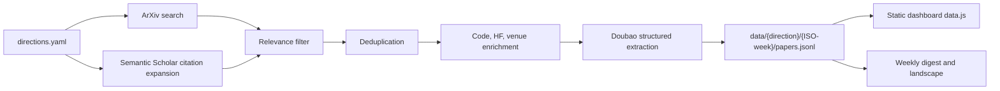

# Knowledge Editing Radar

[](https://www.python.org/)


[中文](README.zh-CN.md)

Knowledge Editing Radar is a focused research-intelligence system for knowledge editing, model unlearning, and editing reliability. It collects recent papers, enriches them with reproducibility and venue signals, extracts structured research fields, and exposes the result through a first-class local dashboard.

## Core Features

| Feature | Role |
| --- | --- |
| Static dashboard | Primary reading surface. Open `index.html` from the repository root, no server required. |
| Daily collection | Scheduled GitHub Actions workflow for ArXiv search, citation expansion, relevance filtering, and storage. |
| Structured extraction | Converts abstracts into method family, edit target, evaluation signal, failure mode, idea hook, and priority fields. |
| Evidence signals | Tracks code repositories, GitHub stars, Hugging Face Daily Paper upvotes, Semantic Scholar citations, and venue labels. |
| Weekly artifacts | Generates `weekly_digest.md` and `landscape.md` for each active research direction. |

## Dashboard

The dashboard is a core product surface, not a side utility.

Open the repository-root entry:

```text
index.html
```

That file redirects to:

```text
radar_dashboard/static/index.html
```

The static dashboard reads `radar_dashboard/static/data.js`, so it works directly from the filesystem. After new data is collected, refresh the static snapshot with:

```bash
python radar_dashboard/build_static.py
```

For API-backed local development:

```bash
python radar_dashboard/app.py
```

Default URL:

```text
http://127.0.0.1:7860
```

## Research Scope

Active directions are defined in `config/directions.yaml`.

| Direction | Focus |
| --- | --- |
| Knowledge editing core methods | ROME, MEMIT, MEND, SERAC, Knowledge Neurons, locate-then-edit methods, and mass editing. |
| Model unlearning | LLM unlearning, selective forgetting, privacy/safety knowledge removal, and retain-forget tradeoffs. |
| Editing reliability and evaluation | Locality, generality, specificity, portability, robustness, side effects, and long-term stability. |
| Editing frameworks, tooling, and benchmarks | EasyEdit, EasyEdit2, benchmarks, toolkits, integration layers, and reproducibility infrastructure. |

## Pipeline



## Quick Start

```bash
git clone https://github.com/TengJiao33/ArXiv_Daily_Digest.git
cd ArXiv_Daily_Digest
python -m venv .venv
.venv\Scripts\activate
pip install -r requirements.txt
```

Open the dashboard:

```text
index.html
```

Run a collection cycle:

```bash
python main.py
```

`python main.py` calls external APIs and may consume Doubao quota. Opening the static dashboard only reads local files.

## Configuration

Create `.env` in the repository root:

```ini
DOUBAO_API_KEY=your_ark_api_key
DOUBAO_ENDPOINT_ID=your_endpoint_id
GITHUB_TOKEN=ghp_your_token
SERVERCHAN_SENDKEY=optional_serverchan_key
WXPUSHER_APP_TOKEN=optional_wxpusher_app_token
WXPUSHER_UIDS=optional_wxpusher_uids
```

GitHub Actions uses the same secret names. The scheduled workflow runs daily at 03:00 UTC, which is 11:00 in Asia/Shanghai.

## Data Layout

```text
data/
  knowledge-editing-core/
    2026-W23/
      papers.jsonl
      weekly_digest.md
      landscape.md
  model-unlearning/
  editing-reliability-evaluation/
  editing-frameworks-tooling/
```

Historical exploration directories such as `data/llm-truthfulness/`, `data/representation-engineering/`, and `data/mechanistic-interpretability/` are preserved as archive data. The dashboard defaults to active directions from `config/directions.yaml`.

## Repository Layout

```text
ArXiv_Daily_Digest/
  index.html                    # Click-to-open dashboard entry
  config/                       # Active directions and venue overrides
  data/                         # JSONL records and generated research artifacts
  radar_dashboard/              # Static dashboard and optional local API server
  main.py                       # Daily collection pipeline
  processor.py                  # Structured extraction
  storage.py                    # JSONL persistence and direction-level deduplication
  digest_builder.py             # Weekly digest generation
  landscape_builder.py          # Weekly landscape generation
  .github/workflows/daily.yml   # Scheduled collection workflow
```

## License

No license file is currently included.
