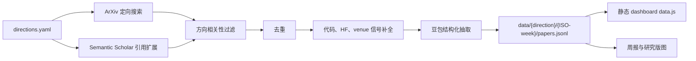

# ArXiv_Daily_Digest

[](https://www.python.org/)


[English](README.md)

ArXiv_Daily_Digest 是研究论文 digest 与 dashboard 项目。当前核心界面是 Knowledge Editing Radar dashboard，聚焦知识编辑、模型遗忘与编辑可靠性。它负责采集近期论文，补全代码、会议、引用和社区热度信号，抽取结构化研究字段，并通过本地 dashboard 形成日常阅读和选题判断入口。

## 核心功能

| 功能 | 定位 |
| --- | --- |
| 静态 Dashboard | 第一阅读入口。直接打开根目录 `index.html`，无需启动服务。 |
| 每日采集 | GitHub Actions 定时执行 ArXiv 搜索、引用扩展、相关性过滤和 JSONL 存储。 |
| 结构化抽取 | 从摘要中提取方法族、编辑对象、评测信号、失败模式、选题钩子和阅读优先级。 |
| 证据信号 | 跟踪代码仓库、GitHub stars、HF Daily Papers upvotes、Semantic Scholar 引用和 venue 标签。 |
| 周度产物 | 为每条 active 方向生成 `weekly_digest.md` 和 `landscape.md`。 |

## Dashboard

Knowledge Editing Radar dashboard 是核心功能，不再作为隐藏工具存在。

直接打开根目录入口：

```text
index.html
```

该入口会跳转到：

```text
radar_dashboard/static/index.html
```

静态 dashboard 读取 `radar_dashboard/static/data.js`，可以直接从文件系统打开。采集数据更新后，重新生成静态快照：

```bash
python radar_dashboard/build_static.py
```

如果需要本地 API 模式：

```bash
python radar_dashboard/app.py
```

默认地址：

```text
http://127.0.0.1:7860
```

## 研究范围

当前 active 方向定义在 `config/directions.yaml`。

| 方向 | 关注点 |
| --- | --- |
| 知识编辑核心方法 | ROME、MEMIT、MEND、SERAC、Knowledge Neurons、locate-then-edit 与大规模编辑。 |
| 模型遗忘与反知识编辑 | LLM unlearning、选择性遗忘、隐私/安全知识移除、保留-遗忘权衡。 |
| 编辑可靠性与评测 | locality、generality、specificity、portability、robustness、副作用和长期稳定性。 |
| 编辑框架、工具与基准 | EasyEdit、EasyEdit2、benchmark、toolkit、方法集成与复现基础设施。 |

## 流程



## 快速开始

```bash
git clone https://github.com/TengJiao33/ArXiv_Daily_Digest.git
cd ArXiv_Daily_Digest
python -m venv .venv
.venv\Scripts\activate
pip install -r requirements.txt
```

打开 dashboard：

```text
index.html
```

运行一次采集：

```bash
python main.py
```

`python main.py` 会访问外部 API，并可能消耗豆包额度。查看已有数据只需要打开静态 dashboard。

## 配置

在仓库根目录创建 `.env`：

```ini
DOUBAO_API_KEY=your_ark_api_key
DOUBAO_ENDPOINT_ID=your_endpoint_id
GITHUB_TOKEN=ghp_your_token
SERVERCHAN_SENDKEY=optional_serverchan_key
WXPUSHER_APP_TOKEN=optional_wxpusher_app_token
WXPUSHER_UIDS=optional_wxpusher_uids
```

GitHub Actions 使用同名 Secrets。定时任务每天 UTC 03:00 运行，对应北京时间 11:00。

## 数据结构

```text
data/
  knowledge-editing-core/
    2026-W23/
      papers.jsonl
      weekly_digest.md
      landscape.md
  model-unlearning/
  editing-reliability-evaluation/
  editing-frameworks-tooling/
```

`data/llm-truthfulness/`、`data/representation-engineering/`、`data/mechanistic-interpretability/` 等探索期目录保留为历史归档。Dashboard 默认只读取 `config/directions.yaml` 中的 active 方向。

## 项目结构

```text
ArXiv_Daily_Digest/
  index.html                    # 点开即看的 dashboard 入口
  config/                       # active 方向与 venue override
  data/                         # JSONL 数据与生成的研究产物
  radar_dashboard/              # 静态 dashboard 和可选本地 API server
  main.py                       # 每日采集主流程
  processor.py                  # 结构化抽取
  storage.py                    # JSONL 存储和方向级去重
  digest_builder.py             # 周报生成
  landscape_builder.py          # 研究版图生成
  .github/workflows/daily.yml   # 定时采集工作流
```

## License

当前仓库未包含 license 文件。
